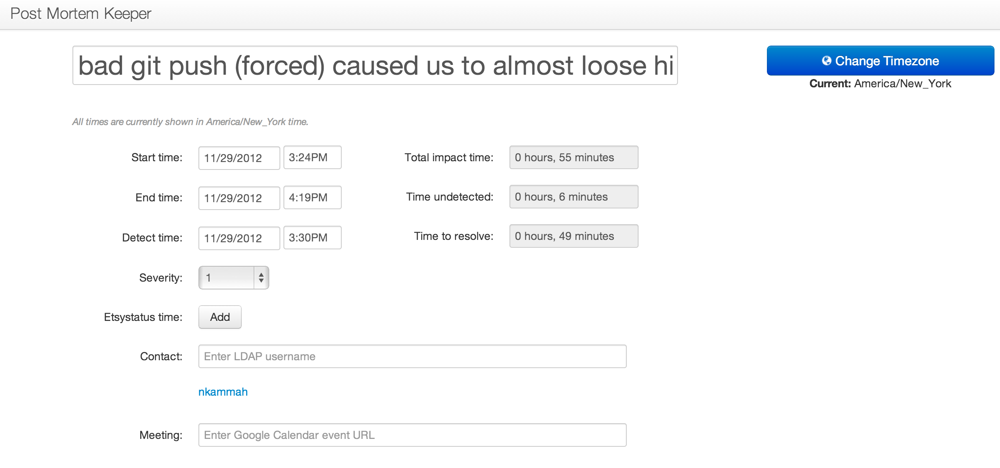
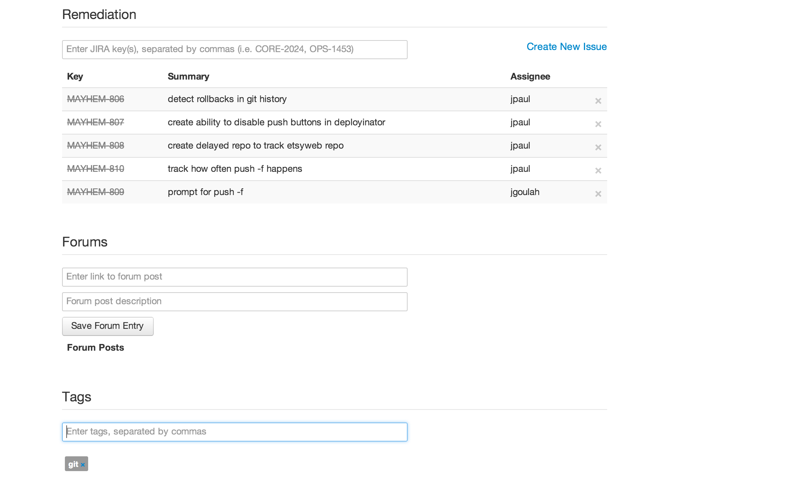
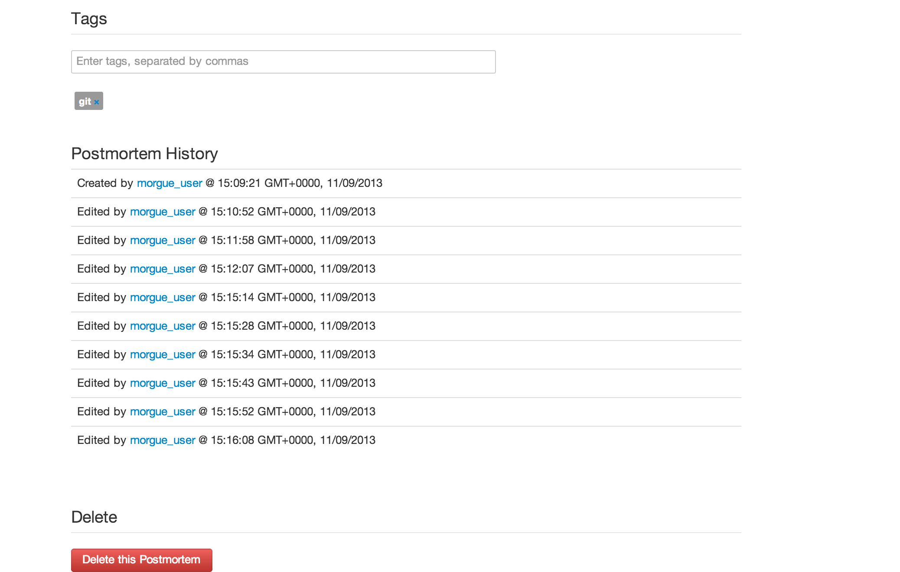

# morgue [](https://travis-ci.org/etsy/morgue) [](https://codeclimate.com/github/etsy/morgue)
## a safe place for all your postmortem data


## Overview
This is a PHP based web application to help manage your postmortems. It has a
pluggable feature system and can pull in related information from IRC and JIRA
as well as storing relevant links and graphs. This [talk][1] from DevOpsDays NYC
2013 gives an introduction and shows some of its features.

You can also join `#morgue` on Freenode IRC if you have questions.

## Morgue tour

### Index page


### Creating a new post mortem


### Live edit page








## Setup

### Requirements
- PHP 7.0 or higher
- MySQL 5.5 or higher
- PHP MySQL driver
- Apache
- mod_rewrite

### Create a morgue configuration file

In the cloned repo, use the **example.json** file as a template to create your
own configuration file.

```
cp config/example.json config/development.json
```

**NOTES**: You may need to remove references to "custom_feature" from your
development.json as those only exist as examples to show you how to add
custom features to your Morgue installation.

### Composer
Morgue relies on the [Slim Framework](http://www.slimframework.com/), a dependency that can be easily managed by Composer.
Directions to install composer can be found on [here][2]).
Once installed, run :

```
php composer.phar update
```

### Apache
This is a basic example for an Apache vhost. The `MORGUE_ENVIRONMENT` variable
is used to determine which config file to use (see above step).

```
    <VirtualHost *:80>
      ServerName   morgue.hostname.com

      DocumentRoot /var/www/morgue/htdocs

      <Directory /var/www/morgue/htdocs>
        AllowOverride All
      </Directory>

      SetEnv MORGUE_ENVIRONMENT development

      php_value include_path "/var/www/morgue:/var/www/morgue/features"
    </VirtualHost>
```

**NOTE**: If you maintain a custom Morgue features outside the document root, be
sure to include that directory in the ``php_value include_path`` directive.

Restart apache and hit the servername you defined above.

### MySQL
Create a database named morgue and give access to the morgue user with the
morgue password defined in the config file you created at step 1
```
CREATE DATABASE morgue;
CREATE USER 'morgue'@'localhost' IDENTIFIED BY 'morgue';
GRANT ALL ON morgue.* TO 'morgue'@'localhost';
SET PASSWORD FOR 'morgue'@'localhost' = PASSWORD('morgue_password');
```

Then add the schema to the database:
```
mysql -p -u morgue -h localhost morgue < schemas/postmortems.sql
```

Note : add any additional schemas you may use:
```
mysql -p -u morgue -h localhost morgue < schemas/images.sql
mysql -p -u morgue -h localhost morgue < schemas/jira.sql
mysql -p -u morgue -h localhost morgue < schemas/links.sql
mysql -p -u morgue -h localhost morgue < schemas/irc.sql
```

### Start a development server

Using PHP built-in webserver it is possible to start quickly viewing what morgue does with the following command run from the document root.

**NOTE**: You may need to do some PHP setup before doing this. Follow the
installation instructions [here][2] to install composer, then from your
morgue base directory run `php composer.phar update` to install and update
the necessary PHP packages.

```
cd htdocs
MORGUE_ENVIRONMENT=development php -d include_path=".:$(dirname `pwd`):$(dirname `pwd`)/features" -S localhost:8000
```

Open http://localhost:8000 to view Morgue

## Configuration


### Features

The configuration of individual features is maintained in an
array of objects -- the 'feature' key on the configuration array.  
Minimally a feature is the name of the feature and if it is "on" or not.

```
"features": [
    {   "name": "my_awesome_feature",
        "enabled": "on"
    }
```

You can add keys and values as needed for your feature. For example:

```
    {   "name": "my_awesome_feature",
        "enabled": "on",
        "extra_awesome_value": 11,
        "lost_numbers": [4,8,15,16,23,42]
    }
```

You can then access these nearly anywhere in the app.

```php
<?php
$feature_options = Configuration::get_configuration('my_awesome_feature');
$lost_numbers = $feature_options['lost_numbers'];
```

A few conventions exist for features to do certain things:
- ```"navbar": "on|off"```  Adds a link to the feature in the main navbar.
- ```"custom_js_assets": ["my.js", "other.js", "http://cdn.com/external.js"]``` Try to load javascripts
- ```"custom_css_assets": ["my.css", "other.css", "http://cdn.com/external.css"]``` Try to load stylesheets

### Edit Page Features

If your feature involves the edit page, you'll need to list it in the
```edit_page_features``` array.  The ordering of this array influences
the ordering of the edit page features from first (top) to last (bottom).
```
   "edit_page_features": [
        "status_time", "contact", "calendar", "summary", "images"
   ]
```

### JIRA feature

**baseurl** the base URL to your jira installation (**use https** if you are using a secured JIRA installation)
**username** username for a user with viewing credentials
**password** password for a user with viewing credentials
**additional_fields** mapping of fields to display in morgue (other than key, summary, assignee, status)

```
    {   "name": "jira",
        "enabled": "on",
        "baseurl": "https://jira.foo.com",
        "username": "jira_morgue",
        "password": "jira_morgue",
        "additional_fields": {
            "Due Date": "duedate",
            "Some Custom Field": "customfield_1234"
        }
    },
```

### IRC Feature

When enabled, the irc features allow the reporting of the IRC channels
discussions were happening during the event. The postmortem tools tries to
retrieve the list of channels in 2 ways:
 - calling the **'morgue_get_irc_channels_list'** if it exits (this function is
 expected to return an array of strings)
 - retrieving the "channels" array from the 'irc' feature config stanza

#### IRC Log feature

When the IRC feature is enabled, the channels listed for a given postmortem will
 be clickable buttons that attempt to retrieve the IRC log history. In order to
 view that history in Morgue, you need to implement the irclogs endpoint.
You can do so by:

1. Create a new feature:  (see below for more detail on creating a new feature)
```
make feature NAME=irclogs
```

2. Add the new feature to your config file (in the features array)

```
    {   "name": "irclogs",
        "enabled": "on",
        "endpoint": "https://path.to.irseach.endpoint"
    }
```


3. Implement the irclogs route

The irclogs route receives parameters in a get request. Morgue will query the
irclogs endpoint with an increasing offset of **20** until it receives no data.
Regardless of how you implement that endpoint, you need to return an empty
response when you no longer have data to feed.

The expected response from the *irclogs* endpoint is a JSON array with the 3
elements: nick, time and message.
```
[
  {'nick':'foo','time':'10:30:03 PM', 'message':'I see foo'},
  {'nick':'bar','time':'10:35:00 PM', 'message':'Oh, I see bar'},
  {'nick':'foo','time':'10:37:34 PM', 'message':'turned out it was baz'}
]
```

 A dummy implementation could look like (content of features/irclogs/routes.php)

```php
<?php

/** irclog endpoint - return IRC logs paginated by 20 entries */
$app->get('/irclogs', function () use ($app) {
    header("Content-Type: application/json");
    $start_date = $app->request->get('start_date');
    $start_time = $app->request->get('start_time');
    $end_date = $app->request->get('end_date');
    $end_time = $app->request->get('end_time');
    $timezone = $app->request->get('timezone');
    $channel = $app->request->get('channel');
    $offset = $app->request->get('offset');

    if ($offset == 0) {
        $results = array(
            array('nick' => 'foo','time' => '10:55 PM', 'message' => 'bar'),
        );
    } else {
        $results = array();
    }
    echo json_encode($results);
});
```

### Creating your own Features

Use **make feature** to generate a skeleton structure for your new feature.
```
% make feature NAME=my_new_feature
making new feature  my_new_feature
Feature directory for my_new_feature created.
Remember to add an entry to your feature config.
% tree features/my_new_feature
features/my_new_feature
├── lib.php
├── routes.php
└── views
    └── my_new_feature.php
```
Add it to and enable it in your config.json.


## Tests
You can run the unit test suite with:
```
make unittests
```

## Contribute

1. Fork the repository
2. Hack away
3. Add tests so we don't accidentally break something in the future
4. Push the branch up to GitHub (bonus points for topic branches)
5. Send a pull request to the etsy/morgue project.

## FAQ

### When I visit a detail event page, I just see a "loooool"

You may have created your schemas before some features that required schema changes were added.
Simply run the migration(s) commands to update your schemas:

```
    alter table postmortems change etsystatustime statustime int(11) UNSIGNED NOT NULL;
    alter table postmortems add column why_surprised text NOT NULL;
```

Or simply :

```
    mysql -p -u morgue -h localhost morgue < schemas/migrations/rename_statustime_column.sql
    mysql -p -u morgue -h localhost morgue < schemas/migrations/add_why_surprised_field.sql
    mysql -p -u morgue -h localhost morgue < schemas/migrations/change_text_to_longtext.sql
    mysql -p -u morgue -h localhost morgue < schemas/migrations/add_event_facilitators.sql
    mysql -p -u morgue -h localhost morgue < schemas/migrations/add_edit_locking.sql

```
[1]: http://vimeo.com/77206751
[2]: https://getcomposer.org/doc/00-intro.md
